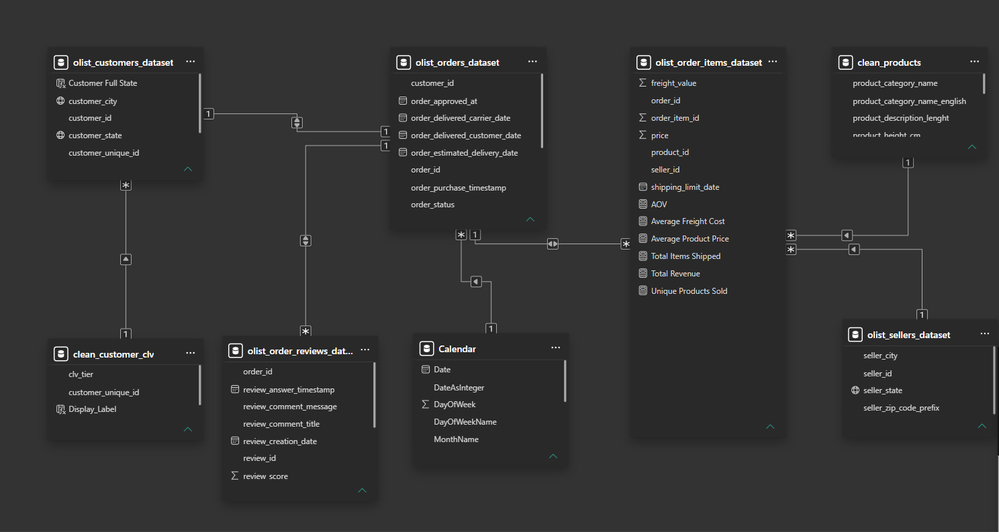
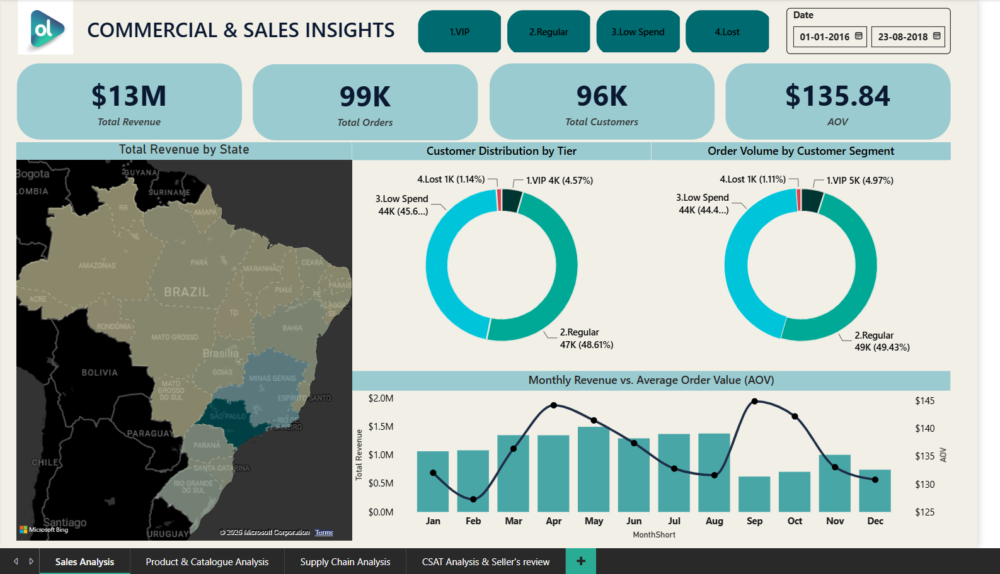
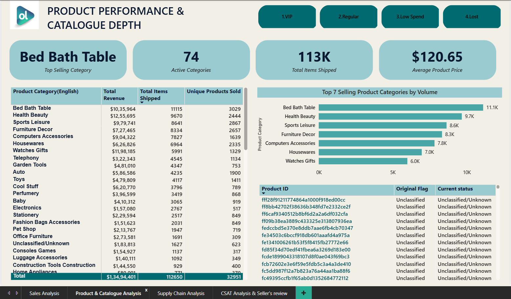
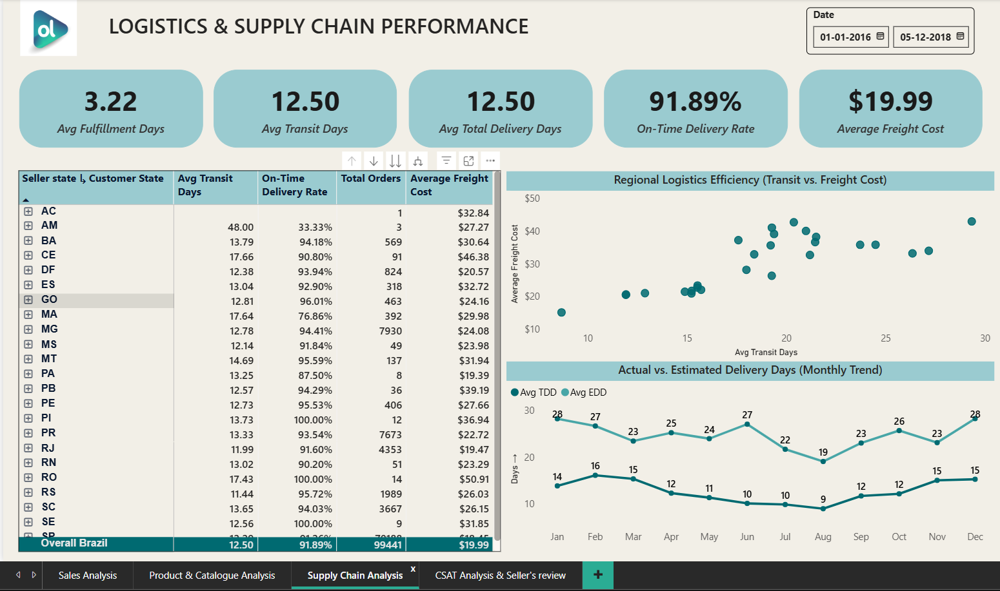
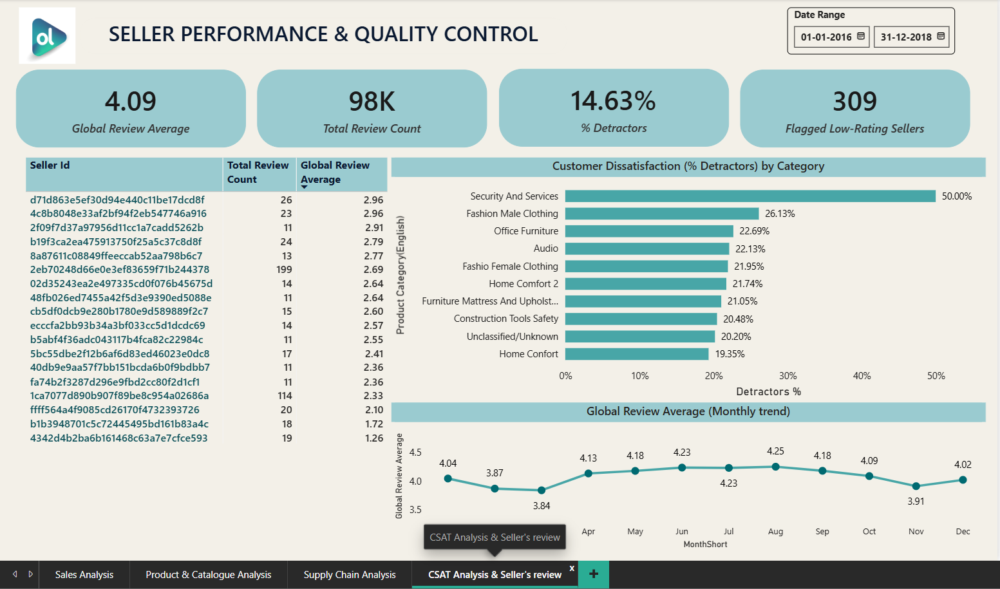

# Olist E-Commerce Analytics Pipeline

An end-to-end data engineering and business intelligence project built over the public Olist e-commerce marketplace dataset. This repository contains a production-grade analytics workflow managing raw data ingestion, programmatic transformation, relational schema modeling, advanced database auditing, and localized executive reporting.

## 📂 Project Structure
* **`data_raw/`** - Local workspace housing the raw source data tracking logs (safely excluded from remote tracking commits via `.gitignore`).
* **`notebooks/`** - Dedicated Jupyter notebook directory containing `Olist Py Scripts.ipynb` for automated programmatic ingestion and customer profile processing.
* **`sql/`** - Relational database script directory housing `marketplace_analytics.sql` for advanced operational, cohort, and geographic performance auditing.
* **`dashboards/`** - Visual reporting layer containing the master `Olist Project.pbix` application file, presentation previews, and database modeling architecture blueprints.

---

## 💼 Business Insights & Operational Outcomes

Every pipeline optimization and query routine in this repository was engineered to solve core marketplace blind spots, converting disconnected operational records into strategic commercial levers:

* **Customer Retention & Lifecycle Value:** Instead of relying on standard transactional totals, the engineering pipeline processes individual logs to compute a 4-tier Customer Lifetime Value (CLV) framework. The analysis exposes a stark retention bottleneck: a massive **96% of the entire marketplace user base consists of one-time buyers**. When mapped to spending brackets, **45.72% of all unique users sit in the "Low Spend / Trial" bracket (<$100)**, while an elite **4.56% qualify as high-value "VIP Spenders" ($500+)**. This proves that while top-of-funnel user acquisition is highly effective, the platform struggles with sudden drop-offs immediately following initial fulfillment.
* **Logistics Bottlenecks & SLA Management:** In a marketplace spanning vast geographic zones, flat country-wide averages mask severe operational failures. By isolating peak operations, the analytical engine proved that delivery times vary drastically by region. Highly urbanized, industrialized coastal hubs (such as São Paulo and Rio de Janeiro) benefit from rapid carrier density and localized warehouses, maintaining fast turnarounds. Conversely, shipping to massive, landlocked interior states spanning the Amazon rainforest or remote northern territories experiences severe logistics lag—with transit times averaging **over 20+ days**, highlighting exactly where the carrier network requires urgent infrastructure investment and regional fulfillment centers.
* **Seller Quality Control & Platform Churn Risk:** To safeguard platform reputation, the engine isolates underperforming merchants. The data successfully flagged the **top 10 lowest-rated marketplace sellers** who maintain a minimum baseline of 50 reviews. These merchants pull down customer satisfaction with average review scores dragging **well below 2.5 out of 5 stars**, giving the compliance team the exact vendor IDs needed for immediate off-boarding.
* **Pipeline Financial Exposure:** Operational queries track order distributions and calculate the exact cash volume trapped in non-successful, unfulfilled order statuses (processing, approved, canceled). The analysis proved that **over 98% of historic cash flow is safely realized in 'delivered' states**, leaving a tight, predictable **less than 2% financial exposure** locked up in active pipeline friction.

---

## 📐 Data Modeling & Relational Schema Optimization

To bridge the gap between raw programmatic ingestion and structured downstream analytics, a clean relational layout was established. Below is the production Entity-Relationship Diagram (ERD) mapping the transactional dependencies across the e-commerce framework:

### Key Schema Challenges & Data Resolutions:
* **The Product Classification Gap:** The initial data audit flagged exactly **623 product IDs entirely lacking a `product_category_name`** (representing roughly 1.89% of the catalog). Left unaddressed, these records trigger broken blank elements in visual cross-filters. The Python transformation engine systematically caught these anomalies, standardizing native descriptions to `"unclassified"` and mapping their English equivalents to `"Unclassified/Unknown"` to preserve dashboard visual integrity.
* **Granularity Mismatches (Order Items vs. Payments):** A classic transactional modeling trap exists between `olist_order_items_dataset` (grain: individual line item) and `olist_order_payments_dataset` (grain: payment method installment). Attempting a direct many-to-many join across these tables introduces severe duplicate row calculation errors (artificial revenue multiplication). 
* **Model Resolution:** The pipeline resolves this by aggregating financial metrics cleanly at the `order_id` layer inside isolated Common Table Expressions (CTEs) and Pandas aggregation operations *before* joining onto the master dimension tables, maintaining strict financial ledger accuracy.

---

## 🎨 UI/UX Design & Corporate Dashboard Previews

To ensure a seamless handoff to corporate stakeholders, the Power BI interface was developed with an intentional focus on executive design principles:

* **Corporate Color Palette:** The report dashboard theme is deeply inspired by the official **Olist brand logo identity**. The layout deliberately avoids generic default application colors, utilizing the corporate primary palette to anchor core KPIs.
* **Semantic Contrast Coding:** Bright accents are strictly reserved for metric callouts, highlighting high-value customer thresholds and extreme regional logistics delays against a clean, uncluttered presentation layout.

### Executive Dashboard Reporting Framework

#### 1. Executive Operations Overview Dashboard

#### 2. Regional Logistics & SLA Analysis Dashboard

#### 3. Behavioral Customer Segmentation Dashboard

#### 4. Vendor Quality Control Audit Dashboard

---

## 🎯 Strategic Business Recommendations

Based on the empirical trends exposed by the pipeline, the following targeted interventions are recommended to optimize platform margins and protect brand equity:

1. **VIP Loyalty Lock-In (The 4.56% Cohort):** Reallocate a portion of general marketing spend toward a dedicated VIP retention program. Implement automated perks for this high-value bracket—such as subsidized freight thresholds and tier-exclusive reward structures—to maximize purchase velocity and prevent platform churn.
2. **De-risking Amazonian Logistics Lag:** Incentivize high-velocity vendors to pre-stage fast-moving inventory categories in regional partner cross-docks situated closer to landlocked northern territories. This systematically shifts transit routes from long-haul external logistics to localized regional distribution channels.
3. **Active Vendor Off-boarding:** Enforce strict operational triggers within the vendor platform framework. Merchants dropping below a rolling average of 3.5 stars over a 60-day window should face immediate volume caps, and the bottom-performing 10 should face programmatic off-boarding to protect long-term customer acquisition costs.
4. **Combating the 96% One-Time Purchase Trap:** Shift marketing focuses away from generic open-market ads and fund hyper-targeted "Second-Purchase Incentives." By analyzing the entry product category of the **45.72% low-spend segment**, automate contextual cross-selling campaigns (such as accessory bundles or free shipping on a second order within 14 days of delivery) to break the single-purchase pattern.

---

## 🛠️ Data Engineering Challenges Overcome

1. **Handling Memory Constraints during Bulk Ingestion:** Massively dense relational logs (such as the geolocation files) easily trigger memory exhaustion errors. The Python pipeline resolves this by chunking data writes during the MySQL upload phase to keep the local compute footprint stable.
2. **Preserving Unfulfilled Customer States:** Standard inner joins across user tables and transaction logs drop accounts that canceled orders. The pipeline preserves these data points using optimized left joins and fallback logic to accurately flag inactive tracks without losing historical tracking records.
3. **Overcoming Connection Engine Syntax Issues:** Administrative database setups using complex string keys containing system symbols (like `@`) can break generic connection strings. The ingestion engine mitigates this by programmatically URL-encoding parameters to guarantee a secure, automated MySQL handshake.

---

## 🚀 Replicating the Pipeline

1. **Clone the Project:** Clone this repository to your local directory.
2. **Download Data Source:** Download the public **Olist E-Commerce Dataset** from Kaggle.
3. **Establish Local Stage:** Place all raw source CSV files directly inside your local `data_raw/` directory.
4. **Run Ingestion:** Run the cells inside `notebooks/Olist Py Scripts.ipynb` sequentially to initialize the schema, process localized tables, and export clean assets.
5. **Execute Analytics:** Load the scripts in `sql/marketplace_analytics.sql` into your database editor to run production queries, or open `dashboards/Olist Project.pbix` to review visual reporting filters.
